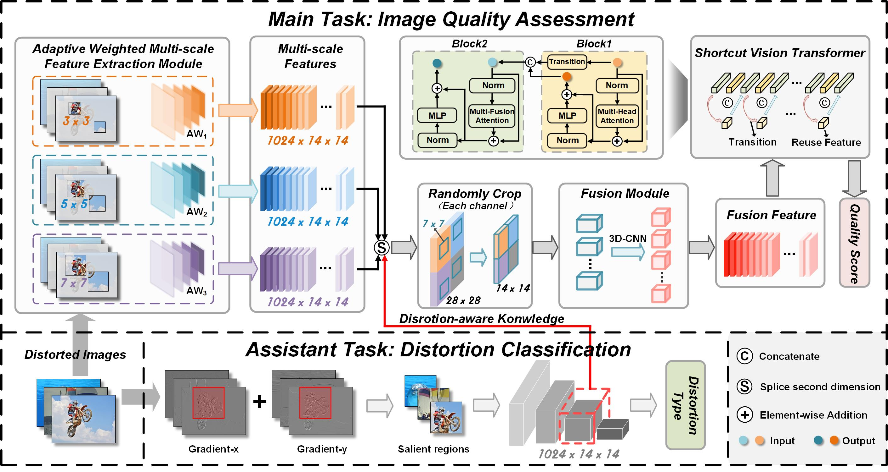

a blind image quality assessment method
Code


## Dataset
| Dataset   | Links                                                       |
| --------- | ----------------------------------------------------------- |
| TID2013      | http://www.ponomarenko.info/tid2013.htm     |
| KADID10K      | http://database.mmsp-kn.de/kadid-10k-database.html      |
| LIVE-C      | https://live.ece.utexas.edu/research/ChallengeDB/index.html      |
| LIVE      | https://live.ece.utexas.edu/research/Quality/subjective.htm          |
| CSIQ      | https://s2.smu.edu/~eclarson/csiq.html |
| SPAQ      | https://github.com/h4nwei/SPAQ |
| KonIQ      | http://database.mmsp-kn.de/koniq-10k-database.html |
| AGIQA     |  https://github.com/lcysyzxdxc/AGIQA-3k-Database |
## Requirements
- PyTorch=1.7.0
- Torchvision=0.8.1
- numpy=1.21.6
- scipy=1.7.3
- h5py=3.7.0
- opencv-python =4.7.0.72
- need to updown the weights of ViT, and name is with "pytorch_model.bin".
## Usages

### Screen out salient regions and non-salient regions of images

If you want to get salient regions, you need to follow the step of sreening method in DFST of dart-into (https://github.com/dart-into/DFST).

```
screen_salient_data.py
```

You will get new datasets, and these datasets are inputs of the model.


####  Q1  When deal with single typle task (open the file "single_task")
```
run.py
```
Then a quality model will be trained.

####  Q21  When deal with few-shot and croos-domain tasks
### Meta training on IQA databases
First you need to modify config paramters to make sure the database path is correct.
Meta training  our model on IQA Dataset.
```
meta.py
```
In meta.py, you can chose KADID or TID2013 to do meta-training, then, use the model to finetune on another. For example, chose TID2013 as meta-training dataset, and finetune on KADID.

We give the optimizal method of the assistant model. If you want employ it on the IQA model, the net need to be change.

Some available options:
* `--dataset`: Meta training  dataset, support datasets: TID2013 |KADID10K| LIVE | CSIQ | .
* `--lr`: Learning rate.
* `--save_path`: Model and paramter save path.
* `--batch_size`: Batch size.
* `--epochs`:Epochs
* 
```
If you want to repartition the dataset, you'll need to make a new mat file instead.

### Fine-tuning for different datasets(Here is an example for CSIQ.)
```
Finetune_csiq_4_1.py
```
Some available options:
* `--dataset_dir`:  Fine-tuning dataset image path.
* `--model_file`: Model and paramter path.
* `--dataset`:  Testing dataset, support datasets:  LIVE-C | SPAQ | KonIQ | CSIQ| AGIQA |.
* `--predict_save_path`: The plcc and srcc are recorded in TID2013_KADID_LIVEC.txt or ew_load_scores.csv.
